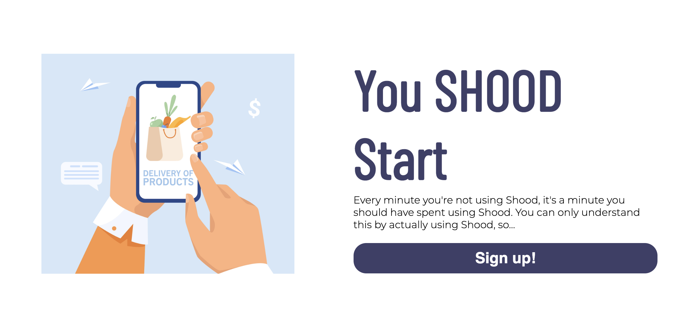

# SHOOD
You can see the live link [here.](https://mjrosi.github.io/my-first-portfolio/)

SHOOD is a search and comparison engine, focused on grocery shopping & delivery. With SHOOD you can compare the price of items in different stores around your you and place simoultaneous orders on those of your choosing.

## Features 

### Existing Features

- __Navigation Bar__

  - Featured on all three pages, the full responsive navigation bar includes links to the Home page, How it Works and Sign Up pages. It is identical in each page to allow for easy navigation.
  - This section will allow the user to easily navigate from page to page across all devices without having to revert back to the previous page via the ‘back’ button. 

- __The landing page image__

  - This section introduces the user to SHOOD with the illustration of a shopping cart an a girl ordering groceries via mobile app.

- __Mission Section__

  - The mission section will allow the user to see the benefits of SHOOD as a search and comparison engine.
  - This user will see the reasons of signing up for SHOOD services. This should encourage the user to choose SHOOD as a service for grocery shopping. 

- __Call to Action__

  - This section will encourge user to sign up to the services by providing the sign up button.

- __The Footer__ 

  - The footer section includes links to the relevant social media sites. The links will open to a new tab to allow easy navigation for the user. 
  - The footer is valuable to the user as it encourages them to keep connected via social media.
  - The footer includes a site map with the links to the three pages of the website.

- __How it works__

  - This page will provide the user with supporting images and texts to show how the service is working.
  - This section is valuable to the user as they will be able to easily see the different stages how to use the SHOOD.

- __The Sign Up Page__

  - This page will allow the user to get signed up to SHOOD services. The user will be asked to submit their full name and email address. 

## Testing
- I tested that this page works in different browsers: Chrome, Firefox, Safari.
- I confirmed that this project is responsive, looks good and functions on all standard screen sizes using the devtools device toolbar.
- I confirmed that the navigation, header, how it works and sign up and text are all readable.
- I have confirmed that the form works: requires in every field and will onluy accept email.

### Validator Testing 

- HTML
  - No errors were returned when passing through the official [W3C validator](https://validator.w3.org/nu/?doc=https%3A%2F%2Fcode-institute-org.github.io%2Flove-running-2.0%2Findex.html)
- CSS
  - No errors were found when passing through the official [(Jigsaw) validator](https://jigsaw.w3.org/css-validator/validator?uri=https%3A%2F%2Fvalidator.w3.org%2Fnu%2F%3Fdoc%3Dhttps%253A%252F%252Fcode-institute-org.github.io%252Flove-running-2.0%252Findex.html&profile=css3svg&usermedium=all&warning=1&vextwarning=&lang=en#css)
- Accessibility
  - I confirmed that the colors and fonts chosen are easy to read and accessible by running it through lighthouse in devtools

### Unfixed Bugs
No unfixed bugs. 

## Deployment

- The site was deployed to GitHub pages. The steps to deploy are as follows: 
  - In the GitHub repository, navigate to the Settings tab 
  - From the source section drop-down menu, select the Main Branch
  - Once the master branch has been selected, the page will be automatically refreshed with a detailed ribbon display to indicate the successful deployment. 

The live link can be found here - https://mjrosi.github.io/my-first-portfolio/index.html

## Credits 

### Content 

- The code to the mission section was taken from Building a simple layout with Flexbox [YouTube tutorial](https://youtu.be/JqJNhM8i-nc)
- The code to sign up form was taken from the Love Running project.
- The icons in the mission section and footer were taken from [Font Awesome](https://fontawesome.com/)

### Media

- All The images used for the website were taken from [freepik](https://www.freepik.com/)
